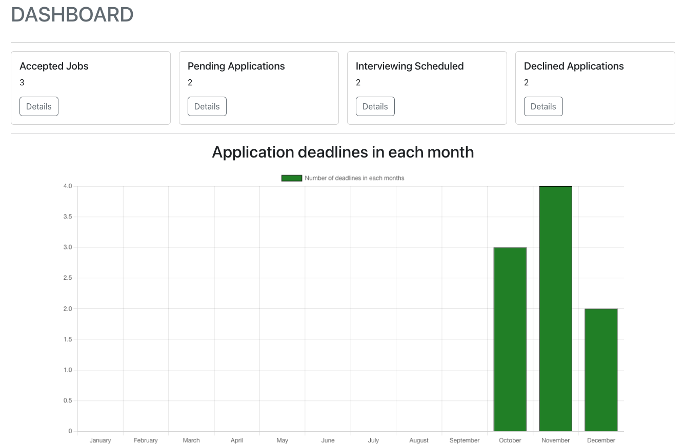
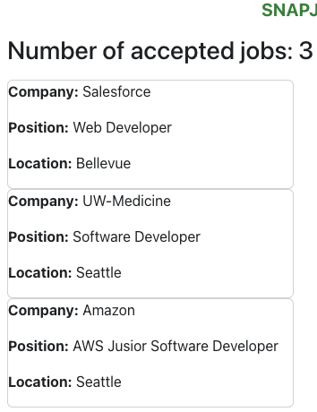
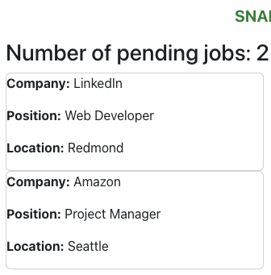
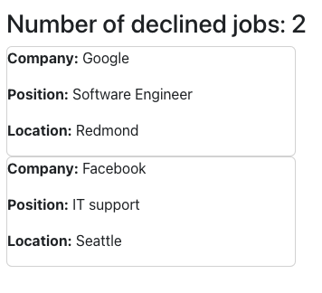

# Introduction
SnapJobs is a full-stack web application that enables users to track their job application progressed by storing, setting status, and searching for each application.

# Technology
React, Node, Express, MongoDB,Javascript, HTML, CSS, express, API,

# Overview

